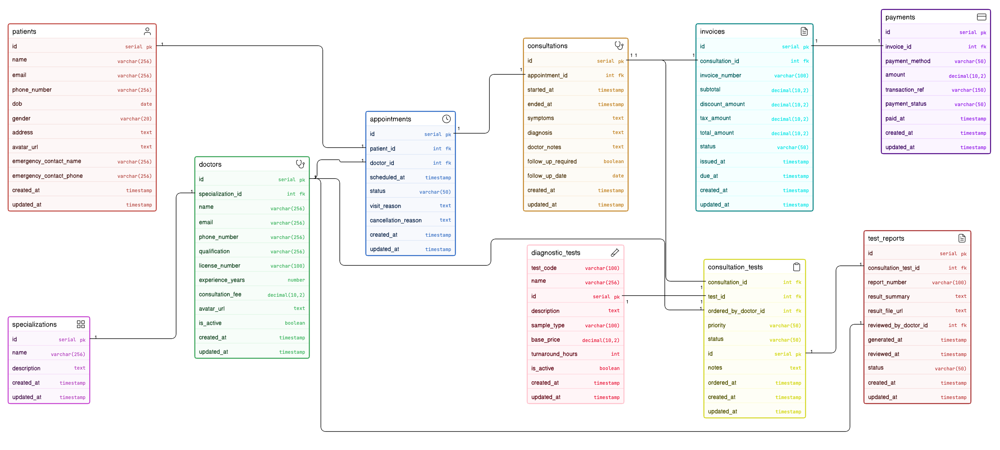

# Clinic Appointment and Diagnostics Platform - ER Diagram

## Overview
This project presents an Entity Relationship Diagram (ERD) for a modern clinic workflow covering:
- patient registration
- doctor management with specialties
- appointment booking and status tracking
- consultation records
- diagnostic test prescriptions
- report generation
- invoice and payment tracking

The design is intentionally focused on a clinic-scale system: clear, normalized, and easy to extend.

## Problem Scope
The ERD models the journey from booking to billing:
1. A patient books an appointment with a doctor.
2. A completed appointment may result in a consultation.
3. During consultation, one or more diagnostic tests can be prescribed.
4. Test reports are generated later.
5. Billing is managed through invoices and payments.

## ER Diagram

## Core Entities
- `patients`
- `specializations`
- `doctors`
- `appointments`
- `consultations`
- `diagnostic_tests`
- `consultation_tests`
- `test_reports`
- `invoices`
- `payments`

## Relationship Summary
- One specialization has many doctors.
- One patient has many appointments.
- One doctor attends many appointments.
- One appointment can produce zero or one consultation.
- One consultation can prescribe many tests (via `consultation_tests`).
- One test can be prescribed in many consultations.
- One consultation test can have zero or one report.
- One consultation has one invoice (design choice for clean billing).
- One invoice can have multiple payments.

## Key Design Decisions
- Appointment and consultation are separate entities to distinguish planned visit vs actual clinical interaction.
- Diagnostic prescriptions are linked to consultation (not directly to appointment) because tests are based on medical evaluation.
- Many-to-many between consultations and tests is handled using `consultation_tests`.
- Reports are linked to ordered consultation tests for clear traceability.
- Doctor specialization is modeled as a separate entity for normalization and reuse.

## PK/FK Quality Highlights
- Every main table uses a single primary key (`id`).
- Foreign keys enforce business flow integrity across appointment -> consultation -> tests -> report -> billing.
- Junction table (`consultation_tests`) ensures scalable handling of multiple tests per consultation.
