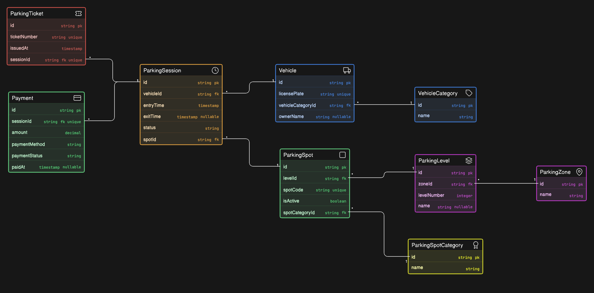

# Comic-Con Parking System - ER Diagram

## Overview
This project presents an Entity Relationship Diagram (ERD) for a multi-zone event parking system serving Comic-Con India. The schema is designed to manage vehicle entry and exit, parking spot allocation across zones and levels, reserved parking categories, session tracking, and payment processing for thousands of convention attendees.

## Diagram Preview

## Business Scope Covered
The Comic-Con parking facility needs to handle:
- Multiple vehicle types (bikes, cars, SUVs, cabs, EV vehicles)
- Multi-zone and multi-level parking infrastructure
- Reserved parking for specific categories (cosplayers with props, exhibitors, creators, VIP guests, staff, EV charging)
- Vehicle entry and exit tracking with timestamp records
- Parking spot allocation and availability management
- Parking session management with entry/exit time recording
- Parking ticket issuance and payment processing
- Support for repeat vehicle visits across multiple event days
- Reusable parking spots across multiple parking sessions

## Core Entities
- vehicles
- vehicle_categories
- parking_zones
- parking_levels
- parking_spots
- parking_spot_categories
- parking_sessions
- parking_tickets
- payments

## Key Relationship Highlights
- One vehicle can have many parking sessions across different event days
- One parking zone contains many parking levels
- One parking level contains many parking spots
- One parking spot can be used by many vehicles across different sessions over time
- One parking session is associated with one vehicle and one parking spot
- One parking session generates one parking ticket
- One parking session can have multiple payments (partial or full payment options)
- Parking spots can be reserved for specific categories (many-to-many relationship)

## Key Design Decisions
- Vehicle and parking spot are separate entities to support a vehicle visiting multiple times and a spot serving multiple vehicles
- Parking session captures the complete entry-exit lifecycle with timestamps for each visit
- Parking zone and level are separated to model the multi-tier facility structure accurately
- Parking spot category is linked separately to support reserved allocations (VIP, staff, EV charging, etc.)
- Parking ticket is generated at entry and linked to the session for easy reference
- Payments are linked to sessions rather than tickets to support partial and multiple payment options
- Junction table between parking_spots and parking_spot_categories to handle reserved parking flexibility

## PK/FK Design Notes
- All major entities use integer primary keys (id)
- vehicle_id in parking_sessions references vehicles.id to track which vehicle is parked
- parking_spot_id in parking_sessions references parking_spots.id for spot allocation
- parking_level_id in parking_spots references parking_levels.id for zone hierarchy
- parking_zone_id in parking_levels references parking_zones.id for zone organization
- vehicle_category_id in vehicles references vehicle_categories.id for vehicle classification
- Junction table (spot_categories) links parking_spots and parking_spot_categories with foreign keys
- session_id in parking_tickets and payments references parking_sessions.id for transactional linkage
