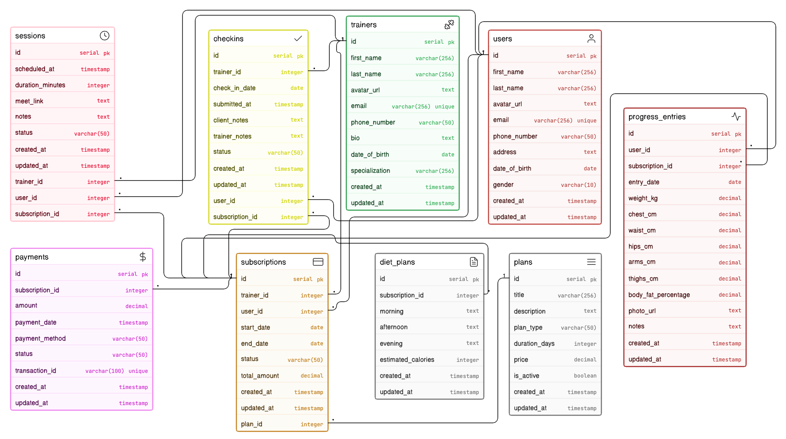

# Fitness Influencer Coaching Platform - ER Diagram

Database design for an online coaching ecosystem where trainers provide paid plans, consultations, check-ins, and progress tracking for multiple clients.

## Diagram Preview

## Project Scope

This ER model is designed to answer business questions such as:

- Who are the trainers and clients?
- Which client purchased which plan?
- What is the active duration of each subscription?
- Which sessions and check-ins were completed?
- How is measurable fitness progress recorded?
- How are payments linked to subscriptions?

## Core Entities

- `users`: Client profile and contact details.
- `trainers`: Coach profile and specialization details.
- `plans`: Coaching programs offered by the platform.
- `subscriptions`: Junction entity connecting user, trainer, and plan with lifecycle fields.
- `sessions`: Scheduled consultations or live coaching calls.
- `checkins`: Periodic updates submitted by clients with trainer feedback.
- `progress_entries`: Measurement history (weight, body metrics, photo reference).
- `diet_plans`: Meal guidance linked to a subscription.
- `payments`: Transaction records for subscriptions.

## Relationship Summary

- One trainer can manage many subscriptions.
- One user can purchase many subscriptions over time.
- One plan can be bought by many users.
- One subscription can have many sessions.
- One subscription can have many check-ins.
- One subscription can have many payments.
- One user can have many progress entries.

## PK/FK Design Notes

- All major entities use integer primary keys (`id`).
- `subscriptions` is the central transactional entity and references:
  - `users.id`
  - `trainers.id`
  - `plans.id`
- `sessions`, `checkins`, and `payments` reference `subscriptions.id`.
- `progress_entries` stores user-level longitudinal measurements using `user_id` and optional subscription linkage.
