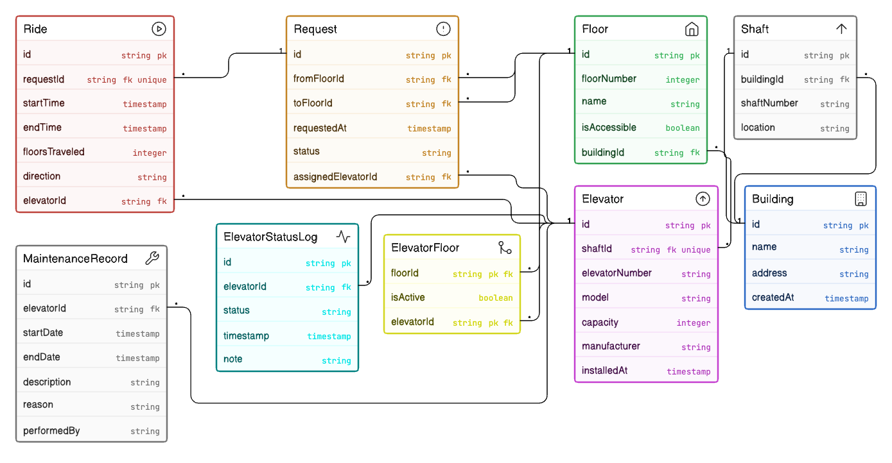

# Smart Elevator Control - ER Diagram

## Overview
This project presents an Entity Relationship Diagram (ERD) for a multi-building smart elevator infrastructure platform used in large commercial and residential complexes.

The schema is designed to support:
- building and floor management
- elevator and shaft mapping
- floor request capture
- ride allocation tracking
- elevator status history
- maintenance history logging

## Diagram Preview

## Business Scope Covered
This ERD models a real-world elevator control backend where:
- One platform manages multiple buildings.
- Each building contains many floors.
- Each building contains many shafts and elevators.
- Elevators can serve multiple floors.
- Floors can be served by multiple elevators.
- Passenger requests are generated from source to destination floors.
- Requests are assigned to elevators.
- Executed rides are logged for analytics and monitoring.
- Elevator operational status changes are tracked over time.
- Maintenance records are stored independently from runtime status.

## Core Entities
- `Building`
- `Floor`
- `Shaft`
- `Elevator`
- `ElevatorFloor` (junction table)
- `Request`
- `Ride`
- `ElevatorStatusLog`
- `MaintenanceRecord`

## Relationship Summary
- One building has many floors.
- One building has many shafts.
- One shaft contains one elevator (modeled with unique `shaftId` in `Elevator`).
- Elevator-to-floor service is many-to-many via `ElevatorFloor`.
- One request is created with one source floor and one destination floor.
- One request is assigned to one elevator.
- One request maps to one ride allocation (via unique `requestId` in `Ride`).
- One elevator completes many rides.
- One elevator has many status log entries.
- One elevator has many maintenance records.

## Key Design Decisions
- Static configuration (`Building`, `Floor`, `Shaft`, `Elevator`) is separated from dynamic operations (`Request`, `Ride`, `ElevatorStatusLog`, `MaintenanceRecord`).
- Real-time status is stored as historical logs instead of a single mutable field, enabling trend analysis and incident audit.
- Floor servicing is normalized through `ElevatorFloor` to support flexible routing and future zone-based activation (`isActive`).
- Request handling and ride execution are modeled separately to distinguish demand generation from fulfilled movement.
- Maintenance events are independent entities so service windows do not overwrite runtime activity history.

## PK/FK Highlights
- All major entities use a primary key (`id`).
- Foreign key hierarchy ensures infrastructure integrity:
	- `Floor.buildingId -> Building.id`
	- `Shaft.buildingId -> Building.id`
	- `Elevator.shaftId -> Shaft.id`
- Request flow integrity:
	- `Request.fromFloorId -> Floor.id`
	- `Request.toFloorId -> Floor.id`
	- `Request.assignedElevatorId -> Elevator.id`
- Ride and logging integrity:
	- `Ride.requestId -> Request.id` (unique)
	- `Ride.elevatorId -> Elevator.id`
	- `ElevatorStatusLog.elevatorId -> Elevator.id`
	- `MaintenanceRecord.elevatorId -> Elevator.id`
- Many-to-many floor service mapping:
	- `ElevatorFloor.floorId -> Floor.id`
	- `ElevatorFloor.elevatorId -> Elevator.id`

## Evaluation Alignment
This design directly supports evaluation checkpoints:
- infrastructure hierarchy (building -> floor/shaft -> elevator)
- clean entity separation between configuration and activity
- correct many-to-many modeling for elevator-floor servicing
- explicit request assignment and ride tracking
- maintenance and status history without data overwrite

## Notes
This submission is focused on database design only (ERD). It does not include SQL queries or API implementation.
